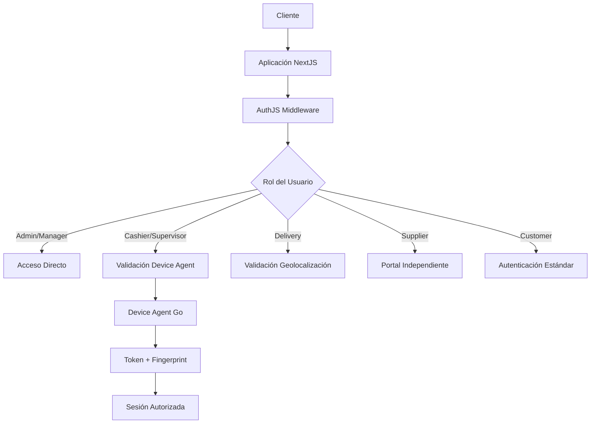
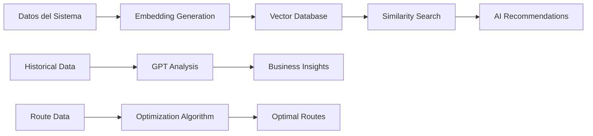

# 🏗️ Arquitectura de Meerkato POS

Este documento describe la arquitectura técnica del sistema Meerkato POS, un sistema integral de punto de venta diseñado con arquitectura de monorepo y múltiples aplicaciones especializadas.

## 📋 Tabla de Contenidos

- [Visión General](#visión-general)
- [Arquitectura de Monorepo](#arquitectura-de-monorepo)
- [Aplicaciones](#aplicaciones)
- [Packages Compartidos](#packages-compartidos)
- [Device Agent](#device-agent)
- [Base de Datos](#base-de-datos)
- [Autenticación y Seguridad](#autenticación-y-seguridad)
- [Integración AI/LLM](#integración-aillm)
- [APIs y Comunicación](#apis-y-comunicación)
- [Deployment](#deployment)

## 🌟 Visión General

### Arquitectura White Label Físico
- **Una instalación separada por comercio** (sin multi-tenancy)
- **Cuatro aplicaciones NextJS independientes** por subdominio
- **Configuración personalizable** por comercio
- **Device Agent en Go** para validación de terminales

### Principios de Diseño
- **Separación de responsabilidades** por dominio de negocio
- **Código compartido** mediante packages del monorepo
- **Seguridad por capas** con validación de dispositivos
- **Escalabilidad horizontal** por aplicación
- **AI-First** para optimización inteligente

## 🏢 Arquitectura de Monorepo

```
meerkato-pos/
├── apps/                    # Aplicaciones NextJS
│   ├── storefront/         # Tienda en línea (puerto 3000)
│   ├── pos/                # Panel administrativo (puerto 3001)
│   ├── suppliers/          # Portal proveedores (puerto 3002)
│   └── delivery/           # App domiciliarios (puerto 3003)
├── packages/               # Código compartido
│   ├── ui/                 # Componentes UI + shadcn/ui
│   ├── database/           # Prisma + tipos + migraciones
│   ├── auth/               # AuthJS configuración
│   ├── ai/                 # Servicios AI/LLM
│   ├── eslint-config/      # Configuración ESLint
│   └── typescript-config/  # Configuración TypeScript
├── device-agent/           # Agente de seguridad en Go
├── scripts/                # Scripts de desarrollo
├── database/               # Configuración PostgreSQL
└── turbo.json             # Configuración Turborepo
```

### Beneficios del Monorepo
- **Código compartido** entre aplicaciones
- **Deployment coordinado** con Turborepo
- **Tipado consistente** con TypeScript
- **Configuración unificada** de herramientas
- **Desarrollo simplificado** con hot reload

## 📱 Aplicaciones

### 🏪 Storefront (meerkato.co)
**Puerto:** 3000
**Propósito:** Tienda en línea pública para clientes

**Características:**
- **SEO completo** con meta tags dinámicos
- **Páginas estáticas** generadas (SSG) para productos
- **Recomendaciones AI** personalizadas
- **Carrito de compras** con persistencia
- **Sistema de pedidos** para domicilio
- **Programa de fidelización** integrado

**Stack Técnico:**
- NextJS 15 con App Router
- Server Side Rendering (SSR) + Static Site Generation (SSG)
- Tailwind CSS + shadcn/ui
- Integración con @meerkato/ai para recomendaciones

### 💼 POS Admin (pos.meerkato.co)
**Puerto:** 3001
**Propósito:** Panel administrativo para el minimarket

**Características:**
- **Dashboard en tiempo real** con WebSockets
- **Módulo de ventas** presenciales
- **Gestión completa de inventario**
- **Control de turnos** y cajeros
- **Sistema de consignación** y liquidaciones
- **Gestión de domicilios** con tracking GPS
- **Reportes avanzados** con insights AI
- **Administración de usuarios** y roles

**Stack Técnico:**
- NextJS 15 con App Router
- Server Side Rendering (SSR) para dashboards dinámicos
- Recharts para visualización de datos
- Integración con Device Agent para validación

### 🤝 Suppliers Portal (proveedores.meerkato.co)
**Puerto:** 3002
**Propósito:** Portal de autoservicio para proveedores

**Características:**
- **Dashboard personalizado** por proveedor
- **Gestión autónoma de catálogos**
- **Carga masiva de productos** (Excel/CSV)
- **Actualización de precios** en tiempo real
- **Gestión de órdenes de compra** digitales
- **Programación de entregas**
- **Comunicación integrada** con el minimarket
- **Reportes de performance** y ventas

**Stack Técnico:**
- NextJS 15 con App Router
- React Hook Form para formularios complejos
- File upload para catálogos masivos
- API routes para procesamiento de datos

### 🚚 Delivery PWA (entrega.meerkato.co)
**Puerto:** 3003
**Propósito:** App móvil para domiciliarios

**Características:**
- **Progressive Web App** instalable
- **Offline capability** con Service Workers
- **GPS tracking** en tiempo real
- **Rutas optimizadas** por AI
- **Procesamiento de pagos** contra-entrega
- **Liquidación automática** de efectivo
- **Push notifications** para nuevos pedidos
- **Touch-optimized UI** para móviles

**Stack Técnico:**
- NextJS 15 con App Router + PWA
- Service Workers para cache offline
- Geolocation API para tracking
- Touch-friendly components

## 📦 Packages Compartidos

### @meerkato/ui
**Propósito:** Componentes UI compartidos basados en shadcn/ui

```typescript
// Estructura
packages/ui/
├── src/
│   ├── components/
│   │   └── ui/          # Componentes shadcn/ui
│   └── lib/
│       └── utils.ts     # Utilidades (cn, formatCurrency, etc.)
└── tailwind.config.ts   # Configuración Tailwind compartida
```

**Componentes Incluidos:**
- Button, Input, Card, Dialog
- formatCurrency, formatDate, formatDateTime
- Configuración de colores y themes
- Utilidades de clasess con clsx + tailwind-merge

### @meerkato/database
**Propósito:** Prisma ORM, esquemas y utilidades de base de datos

```typescript
// Estructura
packages/database/
├── prisma/
│   └── schema.prisma    # Esquema completo con pgvector
├── src/
│   ├── index.ts         # Cliente Prisma exportado
│   └── seed.ts          # Script de seed con datos demo
└── package.json
```

**Características:**
- **Esquema completo** con 30+ tablas
- **Extensión pgvector** para embeddings
- **Soft delete** implementado en todas las tablas
- **Tipos TypeScript** generados automáticamente
- **Seed script** con datos demo realistas

### @meerkato/auth
**Propósito:** Configuración de AuthJS 5.0 compartida

```typescript
// Estructura
packages/auth/
├── src/
│   ├── index.ts         # Configuración AuthJS
│   └── types.ts         # Tipos de sesión extendidos
└── package.json
```

**Características:**
- **AuthJS 5.0 beta** con Prisma Adapter
- **Multi-rol authentication** con validación de dispositivos
- **Device token validation** para terminales POS
- **Session management** con JWT
- **Role-based permissions** helper functions

### @meerkato/ai
**Propósito:** Servicios de AI/LLM y funcionalidades inteligentes

```typescript
// Estructura
packages/ai/
├── src/
│   └── index.ts         # AIService class
└── package.json
```

**Servicios Implementados:**
- **Product recommendations** usando embeddings
- **Demand prediction** con análisis histórico
- **Price optimization** con GPT-4
- **Route optimization** para domicilios
- **Business insights** generados automáticamente
- **Vector similarity** search con pgvector

## 🔐 Device Agent

### Arquitectura del Agente
**Lenguaje:** Go 1.21+
**Puerto:** 8181
**Propósito:** Validación de terminales POS autorizadas

```go
// Estructura
device-agent/
├── main.go              # Servidor HTTP principal
├── go.mod               # Dependencias Go
└── README.md            # Documentación específica
```

### API Endpoints
```http
GET  /health            # Estado del agente
GET  /device-token      # Token actual del dispositivo
POST /validate          # Validar sesión de usuario
GET  /device-info       # Información completa del dispositivo
```

### Características de Seguridad
- **Solo conexiones localhost** (127.0.0.1)
- **Device fingerprinting** basado en hardware
- **Token rotation** cada 15 minutos
- **Session validation** para roles restringidos
- **CORS protection** para aplicaciones autorizadas

### Flujo de Validación
1. **Cashier/Supervisor** intenta hacer login en pos.meerkato.co
2. **POS App** verifica presencia del Device Agent
3. **Device Agent** genera token temporal
4. **AuthJS** valida credenciales + device token
5. **Sesión autorizada** si ambas validaciones pasan

## 🗄️ Base de Datos

### PostgreSQL + pgvector
**Versión:** PostgreSQL 16+ con extensión pgvector

### Diseño del Esquema

#### Tablas Principales
```sql
-- Usuarios y autenticación
users, sessions, device_tokens

-- Clientes y fidelización
customers, loyalty_transactions, promotions

-- Proveedores y consignación
suppliers, supplier_contacts, supplier_catalogs
third_party_suppliers, consignment_products, liquidations

-- Productos e inventario
products, categories, barcodes, inventory_movements
price_history, cost_history

-- Ventas y pedidos
sales, sale_items, orders, order_items

-- Domicilios
delivery_persons, deliveries, delivery_routes
delivery_tracking, delivery_evaluations

-- AI y embeddings
product_embeddings, customer_embeddings
ai_insights, recommendation_logs

-- Administración
shifts, cash_registers, cash_movements
purchase_orders, audit_logs, configurations
```

#### Soft Delete Implementation
```sql
-- Campos obligatorios en tablas principales
deleted_at TIMESTAMP NULL
deleted_by INTEGER REFERENCES users(id)
deletion_reason TEXT NULL

-- Índices para performance
CREATE INDEX idx_products_not_deleted
ON products (id) WHERE deleted_at IS NULL;
```

#### Vector Embeddings
```sql
-- Tabla de embeddings de productos
CREATE TABLE product_embeddings (
    id SERIAL PRIMARY KEY,
    product_id INTEGER REFERENCES products(id),
    embedding vector(1536),
    metadata JSONB,
    created_at TIMESTAMP DEFAULT CURRENT_TIMESTAMP
);

-- Índice para búsqueda vectorial
CREATE INDEX ON product_embeddings
USING ivfflat (embedding vector_cosine_ops);
```

## 🔐 Autenticación y Seguridad

### Arquitectura de Autenticación



### Roles y Permisos

| Rol | Acceso | Restricciones | Validación |
|-----|--------|---------------|------------|
| **ADMIN** | Completo a pos.meerkato.co | Ninguna | Estándar |
| **MANAGER** | Limitado a pos.meerkato.co | Sin configuración crítica | Estándar |
| **SUPERVISOR** | pos.meerkato.co | Solo terminales autorizadas | Device Agent |
| **CASHIER** | Ventas en pos.meerkato.co | Solo funciones de venta | Device Agent |
| **DELIVERY** | entrega.meerkato.co | Geolocalización + turno activo | GPS + Sesión |
| **SUPPLIER** | proveedores.meerkato.co | Solo su información | Portal independiente |
| **CUSTOMER** | meerkato.co | Área personal | Estándar |

### Implementación de Seguridad

#### AuthJS Configuration
```typescript
export const authOptions = {
  providers: [
    CredentialsProvider({
      async authorize(credentials) {
        // Validación de credenciales
        // Verificación de device token para roles restringidos
        // Generación de sesión JWT
      }
    })
  ],
  callbacks: {
    jwt: ({ token, user }) => {
      // Agregar información de rol y permisos
    },
    session: ({ session, token }) => {
      // Expandir sesión con datos del usuario
    }
  }
}
```

#### Device Validation Middleware
```typescript
export async function validateDevice(req: Request) {
  if (requiresDevice(userRole)) {
    const deviceToken = await getDeviceToken()
    const validation = await validateWithAgent(deviceToken, session)
    if (!validation.valid) {
      throw new Error('DEVICE_VALIDATION_FAILED')
    }
  }
}
```

## 🤖 Integración AI/LLM

### Arquitectura de AI



### Servicios AI Implementados

#### AIService Class
```typescript
class AIService {
  // Embeddings
  async generateProductEmbedding(productData)
  async generateCustomerEmbedding(customerData)

  // Recomendaciones
  async getProductRecommendations(customerId, limit)

  // Predicciones
  async predictDemand(productId, days)
  async optimizePrice(productId)

  // Optimización
  async optimizeDeliveryRoute(deliveryPersonId, orderIds)

  // Insights
  async generateBusinessInsights()
}
```

#### Vector Search Implementation
```sql
-- Búsqueda por similitud de productos
SELECT p.id, p.name,
       1 - (pe.embedding <=> $1::vector) as similarity
FROM product_embeddings pe
JOIN products p ON pe.product_id = p.id
WHERE p.deleted_at IS NULL
ORDER BY similarity DESC
LIMIT $2;
```

### Funcionalidades AI por Aplicación

#### Storefront (meerkato.co)
- **Product recommendations** en homepage
- **Similar products** en páginas de producto
- **Smart search** con procesamiento de lenguaje natural
- **Personalized content** basado en historial

#### POS Admin (pos.meerkato.co)
- **Demand predictions** para reabastecimiento
- **Price optimization** suggestions
- **Business insights** en dashboard
- **Anomaly detection** en transacciones

#### Suppliers Portal (proveedores.meerkato.co)
- **Performance analytics** automáticos
- **Market insights** para proveedores
- **Demand forecasting** por producto
- **Competitive analysis** básico

#### Delivery PWA (entrega.meerkato.co)
- **Route optimization** en tiempo real
- **Delivery time predictions**
- **Traffic-aware routing**
- **Performance insights** para domiciliarios

## 🌐 APIs y Comunicación

### API Strategy
- **Server Actions** para mutaciones simples
- **Route Handlers** para APIs complejas
- **tRPC** para comunicación type-safe entre apps
- **WebSockets** para updates en tiempo real

### Internal APIs
```typescript
// Shared API utilities
@meerkato/api
├── trpc/           # tRPC routers compartidos
├── websockets/     # WebSocket handlers
└── types/          # Tipos API compartidos
```

### External Integrations
- **OpenAI API** para funcionalidades LLM
- **Payment Gateways** para procesamiento de pagos
- **Maps API** para geolocalización y rutas
- **Email/SMS** para notificaciones
- **WhatsApp Business API** para comunicación

### Real-time Features
```typescript
// WebSocket implementation
const wss = new WebSocketServer({
  // Real-time order updates
  '/api/orders/live',
  // Delivery tracking
  '/api/delivery/tracking',
  // POS dashboard updates
  '/api/pos/dashboard'
})
```

## 🚀 Deployment

### Vercel Deployment (Recomendado)

#### Configuración Multi-App
```json
// vercel.json
{
  "projects": [
    {
      "name": "meerkato-storefront",
      "source": "apps/storefront",
      "domain": "meerkato.co"
    },
    {
      "name": "meerkato-pos",
      "source": "apps/pos",
      "domain": "pos.meerkato.co"
    },
    {
      "name": "meerkato-suppliers",
      "source": "apps/suppliers",
      "domain": "proveedores.meerkato.co"
    },
    {
      "name": "meerkato-delivery",
      "source": "apps/delivery",
      "domain": "entrega.meerkato.co"
    }
  ]
}
```

#### Environment Variables per App
```bash
# Cada app tiene sus propias variables
DATABASE_URL=
NEXTAUTH_SECRET=
OPENAI_API_KEY=
# etc...
```

### Docker Deployment

#### Multi-Stage Builds
```dockerfile
# Dockerfile.storefront
FROM node:20-alpine AS base
# Build stage
FROM base AS builder
# Production stage
FROM base AS runner
```

#### Docker Compose Production
```yaml
version: '3.8'
services:
  storefront:
    build: ./apps/storefront
    environment:
      - DATABASE_URL=${DATABASE_URL}
    ports:
      - "3000:3000"

  pos:
    build: ./apps/pos
    ports:
      - "3001:3001"

  # etc...
```

### Database Deployment
- **Vercel Postgres** para simplidad
- **Supabase** para features avanzadas
- **Self-hosted PostgreSQL** con pgvector

### Device Agent Deployment
- **Windows Service** usando NSSM
- **Linux systemd** service
- **macOS launchd** daemon

## 📊 Monitoring y Performance

### Observability Stack
- **Vercel Analytics** para métricas web
- **Prisma logging** para queries de DB
- **Device Agent logs** para validaciones
- **Custom metrics** para business KPIs

### Performance Optimizations
- **Image optimization** con Next.js
- **Bundle splitting** por aplicación
- **Database connection pooling**
- **Vector index optimization**
- **Caching strategy** con Redis

### Error Handling
- **Global error boundaries** en React
- **API error standardization**
- **Device Agent failure graceful handling**
- **Database transaction rollbacks**

---

Esta arquitectura proporciona una base sólida, escalable y mantenible para el sistema Meerkato POS, con separación clara de responsabilidades, seguridad robusta y capacidades AI avanzadas.